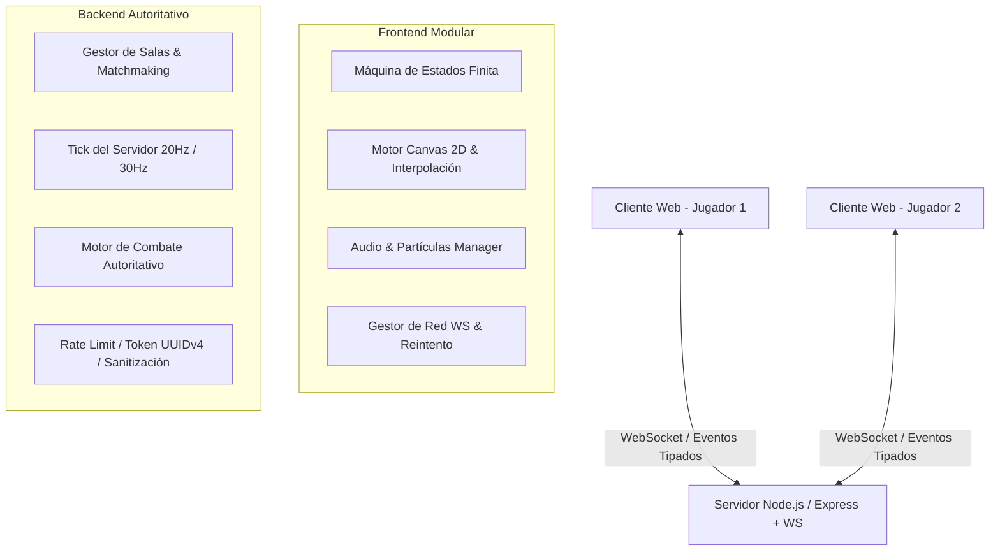

# 🏛️ Animal Combat - Documento de Arquitectura y Diseño del Sistema

## 1. Diagnóstico del Estado Actual (Versión Legacy)

### 1.1 Frontend (`js/mokepon.js`)
- **Monolito de 600+ líneas**: Lógica de presentación, renderizado de canvas, estado de juego y peticiones de red mezclados sin modularidad.
- **Cuello de botella de Red (Polling HTTP agresivo)**: Se ejecutan peticiones `POST` cada **50ms** (`20 req/seg`) para actualizar coordenadas en el canvas mediante `fetch()`, saturando el event loop y generando latencia innecesaria.
- **Lógica de Combate Duplicada**: Existen dos rutinas de resolución (`finalizarJuego()` y `compararAtaques()`), una de las cuales quedó como código huérfano.
- **Simulación Local**: Aunque el mapa detecta enemigos en el servidor, la batalla de combate real se ejecuta de forma local contra IA básica (no hay batalla multijugador real sincronizada).
- **Inseguridad y Manipulación**: La vida, ataques y victoria se calculan 100% en el cliente (fácilmente manipulables desde la consola del navegador).

### 1.2 Backend (`index.js`)
- **Estado Volátil en Memoria**: Array plano `jugadores = []` sin persistencia ni recolector de basura (jugadores desconectados nunca son eliminados, fuga de memoria progresiva).
- **Generación Débil de IDs**: `Math.random()` genera identificadores predecibles y propensos a colisiones.
- **Ausencia de Validación**: Parámetros de entrada sin sanitización ni validación de tipos/esquema.
- **Falta de Seguridad HTTP**: Sin cabeceras Helmet, sin Rate Limiting, CORS totalmente permisivo (`*`).

---

## 2. Arquitectura Objetivo (V2 Modernizada)

---

## 3. Patrones de Diseño Propuestos

1. **Finite State Machine (FSM)**:
   - Estados: `MENU_SELECCION` ➔ `LOBBY_SALA` ➔ `MAPA_EXPLORACION` ➔ `COMBATE_TURNO` ➔ `FIN_PARTIDA`.
2. **Game Loop Desacoplado & Interpolación**:
   - `requestAnimationFrame` en el cliente con Delta Time ($\Delta t$) para animaciones fluidas a 60fps independientes del lag.
   - Envío de coordenadas por WebSockets solo cuando hay cambio de estado o en ticks de 20Hz.
3. **Servidor Autoritativo**:
   - El servidor valida colisiones, turnos de combate, cálculo de daño y condiciones de victoria.
4. **Arquitectura Modular ES6 / TypeScript**:
   - Separación estricta en módulos: `/core`, `/entities`, `/network`, `/ui`, `/audio`.

---

## 4. Estrategia de Seguridad y Escalabilidad

- **Identificadores Criptográficos**: `crypto.randomUUID()` en backend.
- **Room & Session Lifecycles**: Heartbeats (ping/pong cada 10s). Si un cliente no responde en 15s, se desconecta y se limpia la memoria.
- **Rate Limiting por Socket**: Máximo de paquetes por segundo para evitar spam de movimiento o ataques falsos.
- **Validación de Esquema**: Validación de payloads entrantes con esquemas estrictos.
